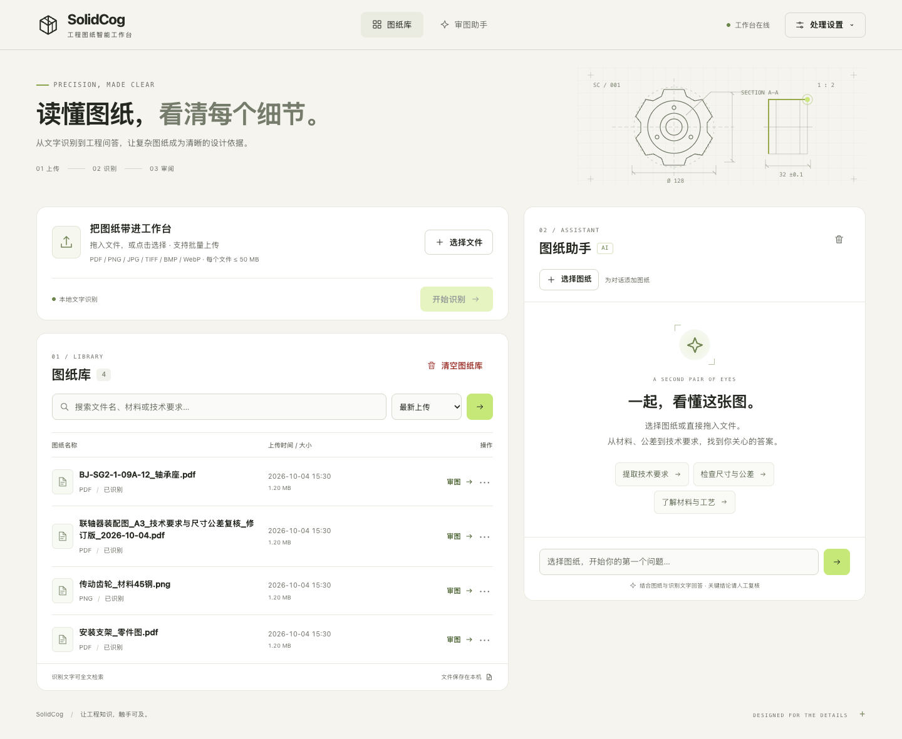
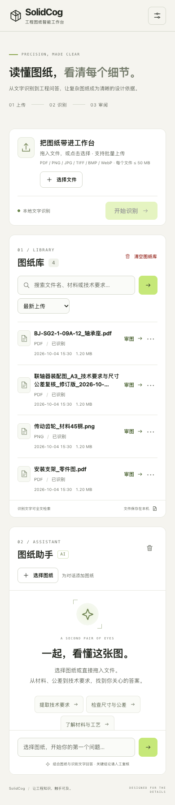

# 图纸工作台改版与验证

本次改版将上传、检索和图纸库组成连续的左侧工作流，右侧保留独立的审图对话。修复状态文案挤压上传按钮、聊天高度随上传内容变化、移动端排布与长文件名干扰操作的问题。模型控制收进处理设置，识别结果页沿用相同的视觉语言。

## 设计自检

| 维度 | 实现与复核 |
| --- | --- |
| 排版 | 中文系统字体负责阅读，等宽字体仅用于编号和制图注释；标题、正文、辅助信息各有稳定层级。最窄屏幕的标题按语义换行。 |
| 留白 | 页面边距随尺寸变化；模块之间保持 20–24 px 间隔。上传进度拥有独立区域，对话采用自身滚动区域，不再按左栏测量高度。 |
| 视觉层级 | 图纸库与助手拥有清晰入口；搜索靠近结果，图纸可直接进入审图。查看、导出和删除收进文件菜单，空库不显示清空操作。 |
| 色彩 | 暖白背景、墨色文字、黄绿主操作；错误采用暗红文字和浅色背景，不靠颜色单独表达状态。输入提示文字提高对比度。 |
| 动效 | 菜单、弹窗及消息使用短时淡入，箭头和操作反馈响应悬停；处理状态采用轻量脉冲。尊重减少动态效果设置。 |
| 微交互 | 批量选择、文件拖入、选中上下文、提问建议、处理进度、失败重试与部分失败提示；弹窗限制键盘焦点，关闭后恢复焦点。中文文件名导出使用 UTF-8 下载名称。 |
| 响应式 | 验证 1920×1080、1440×1000、1440×600、1024×768、768×1024、390×844、320×740。窄屏图纸行转为紧凑布局；低高度桌面取消助手吸附。全部无文档横向溢出。 |
| 原创性 | 自绘工程剖面、齿轮与尺寸线 SVG；几何品牌标记、制图网格、分区编号贯穿工作台和识别结果页。无需远程字体、图片或新前端运行依赖。 |

## 验证结果

- Python 回归测试：48 项通过，包含新增的中文文件名导出测试。
- Chromium 浏览器回归：7 组窗口配置；覆盖设置面板边界、弹窗焦点循环、搜索页面中的全库选择、跨页面上下文、聊天持久化、长文件名进度、部分成功、格式校验、失败重试、后端选择持久化、文件菜单、中文名称下载，以及 OCR 结果页的桌面与移动排布。
- 浏览器未出现页面脚本错误。OCR 结果页另在 1440、390、320 px 宽度确认无横向溢出。
- 使用独立临时数据库与示例图纸。上传、任务轮询和问答使用模拟响应；此次验证针对前端行为，不重新评估 OCR 或审图模型的推理质量。
- 桌面、手机、窄屏和识别结果页逐张查看截图后，修正文字偏小、窄屏标题孤字、日期与大小换行、助手欢迎内容被滚动隐藏等问题。

## 复现

应用 Python 环境执行：

```sh
.venv/bin/python -m unittest discover -s tests -v
```

浏览器测试需要可用的 Node.js、Playwright 包和 Chromium。它会自动启动临时图纸服务并在结束后清理，真实图纸数据库不会被访问：

```sh
NODE_PATH=/path/to/node_modules \
PLAYWRIGHT_CHROMIUM_EXECUTABLE=/path/to/chromium \
SOLIDCOG_SCREENSHOTS=/tmp/solidcog-browser-screenshots \
node tests/browser_workbench.cjs
```

`SOLIDCOG_PYTHON` 可指定应用 Python 路径，默认使用本仓库的 `.venv/bin/python`。已安装 Playwright 自带 Chromium 时，可省略 `PLAYWRIGHT_CHROMIUM_EXECUTABLE`。

## 预览

以下截图使用测试图纸，不包含用户实际图纸数据。




