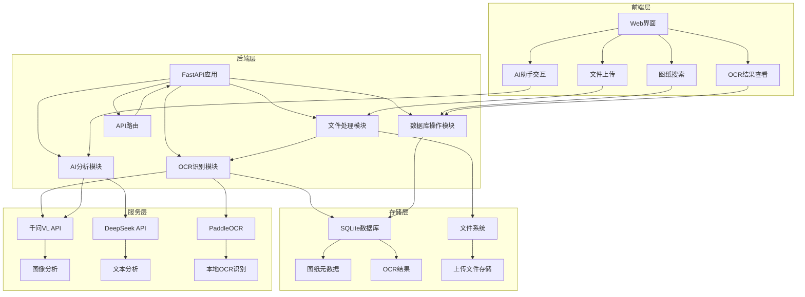

# 工程数字图纸智能管理系统技术文档

## 1. 系统概述

工程数字图纸智能管理系统是一款集成AI技术的工程图纸管理平台，支持PDF/PNG图纸上传、智能OCR识别、自动分析图纸结构和技术要求。具备拖放上传、双模型AI助手、图纸搜索等功能，为工程设计人员提供高效、智能的图纸管理解决方案。

### 1.1 系统特点

- **智能OCR识别**：支持千问VL和PaddleOCR双引擎，提高识别准确率
- **AI助手**：集成千问VL和DeepSeek双模型，提供智能图纸分析
- **拖放上传**：支持从文件浏览器和图纸列表拖动文件
- **图纸搜索**：基于OCR结果的全文搜索
- **结果展示**：分区显示标题栏、技术要求、全局OCR
- **批量上传**：支持同时上传多个PDF/PNG文件

## 2. 系统架构

### 2.1 整体架构



### 2.2 核心组件

1. **前端界面**：基于HTML5、CSS3和JavaScript的单页面应用，使用Jinja2模板引擎
2. **后端服务**：FastAPI框架构建的RESTful API服务
3. **OCR引擎**：支持千问VL（云端）和PaddleOCR（本地）双引擎
4. **AI助手**：集成千问VL和DeepSeek双模型
5. **数据库**：SQLite轻量级数据库，存储图纸元数据和OCR结果
6. **文件系统**：本地文件系统存储上传的图纸文件

## 3. 技术栈

### 3.1 后端技术

| 技术/库 | 版本 | 用途 | 来源 |
|---------|------|------|------|
| Python | 3.9.13 | 主要开发语言 | main.py |
| FastAPI | 0.128.8 | Web框架 | main.py |
| Uvicorn | 0.39.0 | ASGI服务器 | README.md |
| SQLite | - | 数据库 | main.py |
| PaddleOCR | 2.6.1.3 | 本地OCR引擎 | main.py |
| OpenAI SDK | - | 调用千问VL API | main.py |
| requests | - | HTTP请求库 | main.py |
| pdf2image | - | PDF转图片 | main.py |
| OpenCV | - | 图像处理 | main.py |
| Pillow | - | 图像处理 | main.py |

### 3.2 前端技术

| 技术 | 用途 | 来源 |
|------|------|------|
| HTML5 | 页面结构 | templates/index.html |
| CSS3 | 页面样式 | templates/index.html |
| JavaScript | 交互逻辑 | templates/index.html |
| Jinja2 | 模板引擎 | main.py |

### 3.3 第三方服务

| 服务 | 用途 | 来源 |
|------|------|------|
| 千问VL API | 智能图像分析 | main.py |
| DeepSeek API | 文本分析 | main.py |

## 4. 核心功能模块

### 4.1 文件上传模块

**功能**：支持PDF和PNG格式文件的上传，包括单文件和批量上传。

**流程**：
1. 前端选择文件或拖放文件到上传区域
2. 后端接收文件，检查文件类型和大小
3. 生成唯一文件名并保存到本地文件系统
4. 调用OCR模块进行识别
5. 将识别结果存储到数据库

**关键代码**：
- `upload_drawing` 函数 (main.py:495-615)
- 文件保存逻辑 (main.py:525-527)
- 拖放上传前端逻辑 (index.html:466-513)

### 4.2 OCR识别模块

**功能**：对上传的图纸进行OCR识别，提取标题栏、技术要求和全局文本。

**流程**：
1. 检查文件类型（PDF或PNG）
2. PDF文件转换为图片
3. 根据配置选择OCR引擎（千问VL或PaddleOCR）
4. 对图片进行预处理（增强、旋转等）
5. 识别图纸中的文本
6. 提取标题栏、技术要求等关键信息

**关键代码**：
- `run_ocr` 函数 (main.py:253-425)
- `ocr_with_qwen_vl` 函数 (main.py:1261-1356)
- `run_global_ocr` 函数 (main.py:220-234)
- 图像增强函数 (main.py:104-115)

### 4.3 AI助手模块

**功能**：提供基于千问VL和DeepSeek的智能分析功能，可回答用户问题和分析图纸内容。

**流程**：
1. 用户输入问题或拖放图纸文件
2. 前端发送请求到后端
3. 后端根据选择的模型调用相应API
4. 处理API响应并返回给前端
5. 前端展示AI回复

**关键代码**：
- `chat` 函数 (main.py:1047-1086)
- `analyze_with_qwen_vl` 函数 (main.py:1121-1190)
- `analyze_drawing_tool` 函数 (main.py:1523-1589)
- 前端聊天逻辑 (index.html:612-692)

### 4.4 数据库模块

**功能**：存储图纸元数据和OCR结果，支持查询和搜索。

**流程**：
1. 初始化数据库表结构
2. 上传图纸时插入记录
3. 提供查询接口获取图纸列表
4. 支持基于关键词的搜索

**关键代码**：
- `init_database` 函数 (main.py:431-472)
- `get_db_connection` 函数 (main.py:79-87)
- `get_drawings` 函数 (main.py:621-654)
- `search_drawings` 函数 (main.py:744-810)

### 4.5 图像处理模块

**功能**：对图纸图片进行预处理，提高OCR识别准确率。

**流程**：
1. 图像增强（去噪、对比度调整）
2. 旋转处理（处理竖排文字）
3. 区域分割（标题栏、技术要求等）

**关键代码**：
- `enhance_image` 函数 (main.py:104-115)
- `rotate_if_vertical_text` 函数 (main.py:136-144)
- `split_regions_for_horizontal_drawing` 函数 (main.py:146-182)
- `split_regions_for_vertical_drawing` 函数 (main.py:184-218)

## 5. API接口

### 5.1 核心接口

| 接口路径 | 方法 | 功能 | 参数 | 返回值 |
|---------|------|------|------|--------|
| `/` | GET | 系统状态 | 无 | 系统状态信息 |
| `/home` | GET | 显示主页 | 无 | HTML页面 |
| `/主页` | GET | 显示主页（中文） | 无 | HTML页面 |
| `/upload-drawing` | POST | 上传图纸 | files: 文件列表 | 重定向到主页 |
| `/上传图纸` | POST | 上传图纸（中文） | files: 文件列表 | 重定向到主页 |
| `/drawings` | GET | 获取图纸列表 | 无 | 图纸列表JSON |
| `/图纸列表` | GET | 获取图纸列表（中文） | 无 | 图纸列表JSON |
| `/delete-drawing/{drawing_id}` | DELETE | 删除图纸 | drawing_id: 图纸ID | 重定向到主页 |
| `/删除图纸/{drawing_id}` | GET | 删除图纸（中文） | drawing_id: 图纸ID | 重定向到主页 |
| `/删除所有图纸` | GET | 删除所有图纸 | 无 | 重定向到主页 |
| `/search-drawings` | GET | 搜索图纸 | keyword: 关键词<br>page: 页码<br>sort: 排序方式 | HTML页面 |
| `/搜索图纸` | GET | 搜索图纸（中文） | keyword: 关键词<br>page: 页码<br>sort: 排序方式 | HTML页面 |
| `/ocr/{drawing_id}` | GET | 获取OCR结果 | drawing_id: 图纸ID | OCR结果JSON |
| `/查看OCR/{drawing_id}` | GET | 查看OCR结果 | drawing_id: 图纸ID | HTML页面 |
| `/导出OCR/{drawing_id}` | GET | 导出OCR结果 | drawing_id: 图纸ID | 文本文件下载 |
| `/chat` | POST | AI聊天 | prompt: 问题<br>model: 模型 | AI回复 |
| `/analyze-drawing` | POST | 分析图纸 | image_path: 图片路径<br>prompt: 提示词<br>model: 模型类型 | 分析结果 |
| `/analyze-drawing-simple` | POST | 简单分析图纸 | image_path: 图片路径<br>question: 问题<br>model: 模型类型 | 分析结果 |
| `/qwen-tool` | POST | 千问VL工具调用 | tool_call: 工具名称<br>parameters: 参数 | 工具执行结果 |

### 5.2 请求/响应示例

**上传图纸**

请求：
```
POST /upload-drawing
Content-Type: multipart/form-data

[文件数据]
```

响应：
```
303 Redirect to /主页
```

**AI聊天**

请求：
```
POST /chat
Content-Type: application/json

{
  "prompt": "这张图纸的技术要求是什么？",
  "model": "qwen-vl-plus"
}
```

响应：
```
{
  "content": "根据图纸分析，技术要求包括：1. 材料采用Q235钢..."
}
```

**搜索图纸**

请求：
```
GET /搜索图纸?keyword=钢筋&page=1&sort=desc
```

响应：
```
HTML页面，显示搜索结果
```

## 6. 数据库设计

### 6.1 表结构

**drawings表**

| 字段名 | 数据类型 | 描述 |
|--------|----------|------|
| id | INTEGER | 主键，自增 |
| filename | TEXT | 文件名 |
| file_type | TEXT | 文件类型（.pdf或.png） |
| file_size | INTEGER | 文件大小（字节） |
| upload_time | TEXT | 上传时间 |
| title_text | TEXT | 标题栏OCR结果 |
| tech_text | TEXT | 技术要求OCR结果 |
| all_text | TEXT | 全局OCR结果 |
| layout | TEXT | 图纸布局（horizontal/vertical） |

### 6.2 索引

系统会自动为常用查询字段创建索引，提高搜索性能。

## 7. 系统配置

### 7.1 环境配置

- **Python版本**：3.9.13+
- **依赖安装**：
  ```bash
  # Windows
  install.bat
  
  # Linux/MacOS
  chmod +x install.sh
  ./install.sh
  ```

### 7.2 API密钥配置

在 `main.py` 文件中配置API密钥：

```python
# 千问API配置
QWEN_API_KEY = "你的千问API密钥"
QWEN_BASE_URL = "https://dashscope.aliyuncs.com/compatible-mode/v1"

# DeepSeek API配置
DEEPSEEK_API_KEY = "你的DeepSeek API密钥"
```

### 7.3 OCR引擎配置

在 `main.py` 文件中配置OCR引擎：

```python
# 启用千问VL OCR模式
USE_QWEN_VL_OCR = True  # 设置为True使用千问VL，False使用PaddleOCR
```

## 8. 部署与运行

### 8.1 启动服务

```bash
uvicorn main:app --reload --host 0.0.0.0 --port 8000
```

### 8.2 访问地址

- 主页：http://localhost:8000/主页
- API文档：http://localhost:8000/docs
- 系统状态：http://localhost:8000/

### 8.3 部署建议

- **生产环境**：使用Gunicorn作为WSGI服务器，配合Nginx反向代理
- **数据库**：生产环境建议使用PostgreSQL或MySQL
- **存储**：生产环境建议使用云存储服务
- **安全**：配置HTTPS，设置API密钥环境变量

## 9. 性能优化

### 9.1 优化策略

1. **OCR引擎选择**：根据图纸复杂度选择合适的OCR引擎
2. **图像处理**：使用图像增强技术提高OCR准确率
3. **并行处理**：PDF转图片时使用多线程
4. **缓存机制**：缓存OCR结果，避免重复识别
5. **数据库索引**：为搜索字段创建索引

### 9.2 性能指标

- **文件上传**：支持最大50MB文件
- **OCR识别**：单页图纸识别时间 < 10秒
- **AI分析**：响应时间 < 5秒
- **搜索速度**：毫秒级响应

## 10. 安全措施

### 10.1 安全策略

1. **文件验证**：检查文件类型和大小，防止恶意文件
2. **文件名处理**：清理文件名，防止路径遍历攻击
3. **API密钥保护**：建议使用环境变量存储API密钥
4. **输入验证**：对所有用户输入进行验证
5. **错误处理**：避免向用户暴露详细错误信息

### 10.2 防护措施

- **SQL注入防护**：使用参数化查询
- **XSS防护**：对输出进行转义
- **CSRF防护**：实现CSRF令牌
- **文件上传安全**：限制文件类型和大小

## 11. 故障排查

### 11.1 常见问题

| 问题 | 可能原因 | 解决方案 |
|------|----------|----------|
| 上传失败 | 文件类型不支持 | 确保上传PDF或PNG文件 |
| OCR识别失败 | API密钥错误 | 检查API密钥配置 |
| 服务器启动失败 | 端口被占用 | 更改端口或停止占用端口的进程 |
| AI助手无响应 | 网络连接问题 | 检查网络连接和API密钥 |
| 搜索无结果 | 关键词错误 | 尝试使用不同的关键词 |

### 11.2 日志分析

系统使用Python标准日志模块，日志级别设置为INFO，可通过查看日志文件了解系统运行状态。

## 12. 未来规划

### 12.1 功能扩展

1. **多格式支持**：增加对DWG、DXF等工程图纸格式的支持
2. **3D图纸分析**：支持3D模型的分析和识别
3. **批量处理**：增加批量OCR和分析功能
4. **协作功能**：添加用户权限管理和协作编辑
5. **移动端支持**：开发移动端应用

### 12.2 技术升级

1. **模型优化**：集成更多AI模型，提高识别准确率
2. **性能优化**：使用分布式处理提高大文件处理速度
3. **云服务集成**：集成更多云服务，如对象存储、AI服务等
4. **容器化部署**：提供Docker容器化部署方案
5. **CI/CD**：实现持续集成和持续部署

## 13. 总结

工程数字图纸智能管理系统是一款集成了现代AI技术的工程图纸管理平台，通过结合千问VL和PaddleOCR的优势，实现了高效、准确的图纸识别和分析。系统架构清晰，功能完善，界面友好，为工程设计人员提供了智能化的图纸管理解决方案。

系统采用模块化设计，便于维护和扩展，同时注重性能和安全，适合在生产环境中使用。未来，系统将继续升级和扩展，为用户提供更多先进的功能和更好的使用体验。